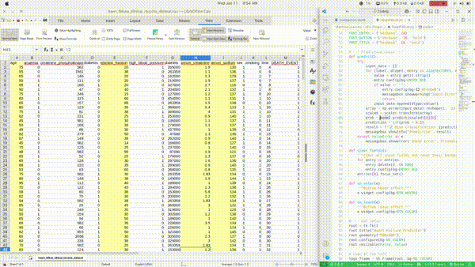
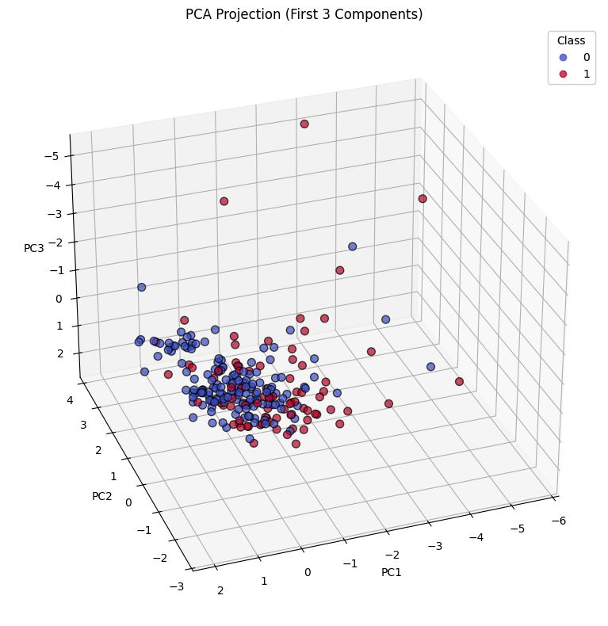
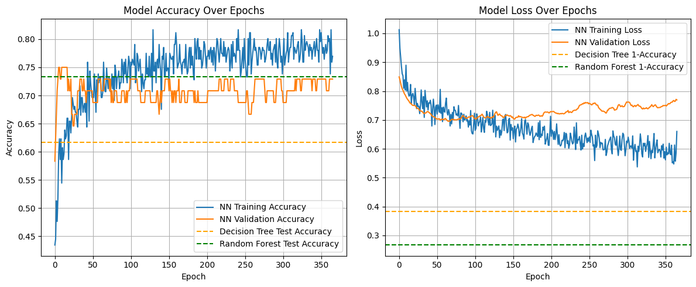
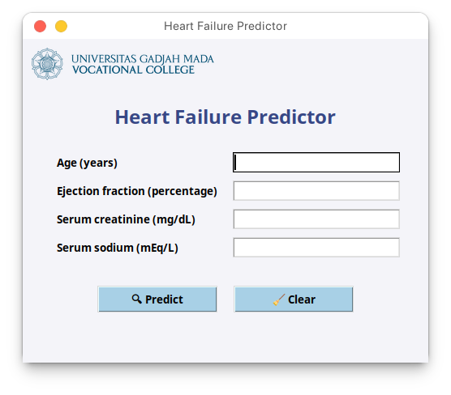

# 🫀 Heart Failure Survival Prediction using Machine Learning

### A Comparative Study of Decision Tree, Random Forest, and Neural Network Models

**Authors**:  
- Thoriq Putra Belligan  
- Daffa Pratama Putra Riyantoso  

Department of Electrical and Informatics Engineering, Universitas Gadjah Mada

---

## 🎬 Demonstration

Here's a quick demonstration of the prediction process and GUI in action:

---

## 📖 Project Summary

This project presents a comparative analysis of three machine learning models—**Decision Tree**, **Random Forest**, and **Neural Network**—for predicting patient survival outcomes in cases of heart failure. The study was motivated by the global burden of heart disease and the clinical need for accurate, accessible, and data-efficient prediction tools.

By utilizing only four routinely collected clinical features, this research demonstrates the feasibility of deploying predictive models even in settings with limited patient data.

---

## 🧪 Clinical Features Used

The models were trained using a subset of the most predictive variables:

- **Serum Creatinine**
- **Ejection Fraction**
- **Age**
- **Serum Sodium**

These were selected based on a correlation-based feature selection process, emphasizing a minimal-feature strategy.

---

## 📷 Conceptual Workflow

The figure below illustrates the overall workflow, from data preprocessing to model evaluation:

---

## 🧠 Machine Learning Models

The study implemented and evaluated the following models:

1. **Decision Tree**  
   Simple and interpretable, but limited in handling complex patterns.

2. **Random Forest**  
   An ensemble of decision trees offering better generalization and robustness.

3. **Neural Network (Deep Learning)**  
   Capable of modeling non-linear relationships with regularization techniques to prevent overfitting.

All models were developed in **Python 3** using libraries such as **Scikit-learn**, **TensorFlow**, and **Keras**.

---

## ⚙️ Methodology Overview

- **Dataset**: 299 patients (public dataset from UCI repository)  
- **Preprocessing**:
  - Z-score normalization
  - Stratified train-test split (70:30)
  - Class balancing using `class_weight`
- **Dimensionality Reduction**: PCA for 3D visualization  
  
- **Evaluation Metrics**:
  - Accuracy
  - F1-Score
  - AUC-ROC
  - AUC-PR
  - Confusion Matrix

Each experiment was repeated 10 times with different random seeds for robustness.

---

## 📊 Results Summary

| Model           | Accuracy | F1 Score | AUC-ROC | AUC-PR |
|-----------------|----------|----------|---------|--------|
| Neural Network  | 78.33%   | 0.6957   | 0.8452  | 0.6701 |
| Random Forest   | 75.00%   | 0.6316   | 0.8010  | 0.6124 |
| Decision Tree   | 70.00%   | 0.5714   | 0.7350  | 0.5789 |

The **Neural Network** demonstrated the highest overall performance across all metrics.

---

## 📈 Model Training Performance

The chart below shows the training and validation accuracy/loss over epochs for the neural network model:

---

## 🖥️ Graphical User Interface (GUI)

To enhance accessibility, a basic GUI was developed to demonstrate the practical use of the trained model:

---

## 📁 Files Included

- `training model.ipynb` — Jupyter notebook containing all model development and evaluation steps
- `README.md` — Project summary and documentation
- `conceptual figure.png` — Conceptual methodology pipeline
- `PCA.png` — PCA 3D scatter plot of feature projection
- `modelAccuracyOverEpoch.png` — Training vs. validation trends
- `GUI.png` — Screenshot of the user interface for model testing

---

## 🔍 Key Takeaways

- High prediction accuracy can be achieved using only 4 clinical features.
- The neural network outperformed both tree-based models in discriminative power.
- This project supports the implementation of lightweight ML models in real-world medical systems, especially where data is scarce.

